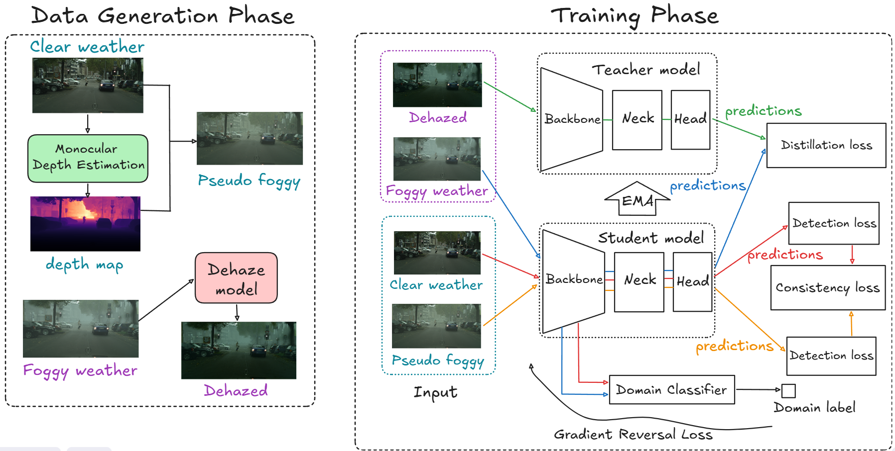

# FusionDA — Enhancing Object Detection Performance under Foggy Conditions through Fusion Domain Adaptation

Checkpoints & generated datasets: [byvn.net/VKY1](https://byvn.net/VKY1)

---

## 1.  Method overview

<p align="center">
  
</p>

---

## 2.  Repository layout

After the recent code reorganisation, all source code lives under `src/`:

```
FusionDA/
├── README.md                  # ← this file
└── src/
    ├── train.py               # main FusionDA trainer (YOLO26 / YOLOv5m)
    ├── train_fasterrcnn.py    # FusionDA on Faster R-CNN (R50-FPN)
    ├── train_yolov5m.py       # FusionDA on YOLOv5m
    ├── fusion_da.py           # losses, EMA, paired multi-domain dataset
    ├── domain_adaptation.py   # GRL discriminator + feature hooks
    ├── yolo26eval.py          # COCO-style mAP evaluation (Ultralytics)
    ├── eval_v5m.py            # YOLOv5m evaluation
    ├── eval_r50fpn.py         # Faster R-CNN evaluation
    ├── fasterrcnn/            # Faster R-CNN model + DA hooks
    ├── utils/                 # FDA helpers, explainability, logger, monitors
    ├── explain/               # RQ2 figures (UMAP, MMD, C2PSA attention, diffs)
    ├── configs/
    │   ├── data/              # dataset YAMLs (Cityscapes pair, WIDERFACE)
    │   ├── train_config.yaml  # YOLO26 hyperparameters
    │   ├── train_config_yolov5m.yaml
    │   └── train_config_fasterrcnn.yaml
    ├── scripts/               # one shell script per ablation variant
    ├── docs/                  # report PDF, pipeline figure, supplementary notes
    └── CUT-phase/             # legacy CUT/CycleGAN translators (not used by FusionDA)
```

> **All scripts and configs use relative paths and therefore must be run from inside `src/`.** No imports were broken by the move — `explain/*.py` resolve their helpers via `Path(__file__).parent.parent`, and every config/CLI uses `configs/...` / `datasets/...` relative to the current directory. The only side-effects of the reorganisation are the path updates reflected in this README.

---

## 3.  Quick start

### 3.1  Environment & data

```bash
git clone https://github.com/khasnhmissu/FusionDA.git
cd FusionDA/src
bash scripts/setup_env.sh        # venv + PyTorch (CUDA 11.8) + datasets + YOLO26-s weights
source venv/bin/activate
```

`setup_env.sh` provisions the following layout under `src/datasets/`:

```
datasets/
├── source_real/source_real/{train,val}/{images,labels}     # Cityscapes (clear)
├── source_fake/source_fake/{train,val}/{images,labels}     # pseudo-foggy (Depth-Anything-V2 + ASM)
├── target_real/target_real/{train,val}/{images,labels}     # Foggy Cityscapes
└── target_fake/target_fake/{train,val}/{images,labels}     # dehazed (AOD-Net)
```

### 3.2  Reproduce the full ablation

```bash
bash scripts/run_all_ablations.sh
```

This launches the same training runs that produced the numbers in the thesis and prints a summary table. To run a single variant:

```bash
bash scripts/01_baseline.sh                       # (a) pure detection, no DA
bash scripts/02_teacher_only.sh                   # (b) Mean-Teacher distillation only
bash scripts/03_source_fake_no_consistency.sh     # (c) +pseudo-foggy supervised branch
bash scripts/04_consistency.sh                    # (e) FusionDA w/o GRL (adds L_con)
bash scripts/05_grl.sh                            # (f) full FusionDA (adds GRL)
```

Each script writes weights, debug images and logs to `runs/ablation/<name>/`.
Companion sweeps are provided for the other backbones and datasets:

```bash
bash scripts/06_grl_size_sweep.sh                 # YOLO26-{n,s,m,l,x}
bash scripts/07_hyperparam_sensitivity.sh         # GRL weight / consistency weight sweep
bash scripts/08_baseline_yolov5m.sh               # YOLOv5m baseline
bash scripts/09_fusionda_yolov5m.sh               # YOLOv5m + FusionDA
bash scripts/11_baseline_fasterrcnn.sh            # Faster R-CNN R50-FPN baseline
bash scripts/12_fusionda_fasterrcnn.sh            # Faster R-CNN R50-FPN + FusionDA
bash scripts/wider_run_all.sh                     # WIDERFACE-easy supplementary RQ3
```

### 3.3  Inference & evaluation

```bash
# YOLO-format .txt predictions per image
python inference.py \
  --weights yolo26s.pt \
  --checkpoint runs/ablation/05_grl/weights/best.pt \
  --source     datasets/target_real/target_real/val/images \
  --output     predicts/05_grl

# COCO-style mAP via Ultralytics
python yolo26eval.py \
  --weights runs/ablation/05_grl/weights/best.pt \
  --data    configs/data/data.yaml --split test
```

For the other backbones use `eval_v5m.py` (YOLOv5m) or `eval_r50fpn.py` (Faster R-CNN R50-FPN).

